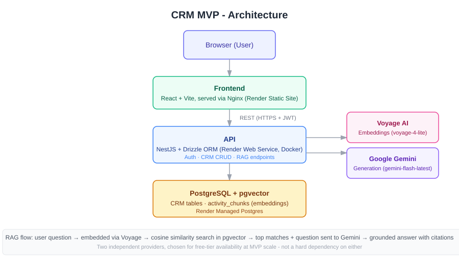

# CRM MVP — with RAG-powered AI Assistant

A CRM built from scratch (auth, contacts, accounts, leads, pipelines, deals, activity timeline) with a Retrieval-Augmented Generation layer on top — ask natural-language questions about a deal or get an AI-generated summary, grounded in the actual notes logged against it.

**Live demo:** `https://crm-mvp-1-h9aq.onrender.com`
**Demo login:** `admin@test.com` / `password123` (or link your Gist here once it exists)

https://github.com/user-attachments/assets/d4296332-7e0c-4533-9152-6d4d6af3b2b4

---

## Architecture



- **Frontend:** React + Vite + TanStack Query + Tailwind, served via Nginx
- **API:** NestJS + Drizzle ORM, TypeScript end-to-end
- **Database:** PostgreSQL with the `pgvector` extension — one database for both relational CRM data and vector embeddings
- **Embeddings:** Voyage AI (`voyage-4-lite`)
- **Generation:** Google Gemini (`gemini-flash-latest`)

---

## Running locally

### Prerequisites

- Docker + Docker Compose
- Node.js 22+ (only needed if running outside Docker)
- API keys: [Voyage AI](https://dashboard.voyageai.com) (free tier), [Google AI Studio](https://aistudio.google.com) (free tier)

### With Docker (recommended)

```bash
git clone <repo-url>
cd crm-mvp
cp .env.example .env   # fill in JWT_SECRET, VOYAGE_API_KEY, GEMINI_API_KEY
docker compose up --build
```

- Frontend: `http://localhost:5173`
- API: `http://localhost:3000`

### Without Docker (local dev)

```bash
git clone <repo-url>
cd crm-mvp
npm install

# Postgres with pgvector (still via Docker, or point at your own instance)
docker run -d --name crm-postgres -e POSTGRES_PASSWORD=postgres -e POSTGRES_DB=crm_mvp -p 5433:5432 pgvector/pgvector:pg16

cp apps/api/.env.example apps/api/.env   # fill in DATABASE_URL, JWT_SECRET, VOYAGE_API_KEY, GEMINI_API_KEY
cd apps/api && npx drizzle-kit migrate && cd ../..

npm run start:dev -w apps/api   # terminal 1
npm run dev -w apps/web         # terminal 2
```

### Seeding demo data

```bash
npx tsx --env-file=apps/api/.env apps/api/src/scripts/seed-demo-data.ts
```

Creates 8 realistic demo deals across different pipeline stages and outcomes, each with several embedded activity notes — useful for actually seeing the AI features do something interesting.

---

## Feature overview

- Auth (JWT, role-based: admin / manager / sales_rep)
- Contacts, Accounts, Leads (with conversion → Account + Contact + Deal), Deals, Pipelines/Stages
- Kanban pipeline board (drag-and-drop stage transitions)
- Polymorphic activity timeline (notes, calls, meetings, tasks, stage changes) attached to any entity
- Dashboard: pipeline funnel + won/lost summary
- **AI Assistant sidebar** — ask questions about a specific deal, grounded in its notes, with source citations
- **AI-generated deal summaries** — pain points, next steps, close likelihood, in one click

---

## RAG design decisions

The choices below were made deliberately for an MVP at this data scale (dozens to low hundreds of activity notes), not because they're the only correct answer at any scale. Documenting the reasoning here rather than just the code, since the "why," not just the "what," is what I'd want to be able to explain in a design review.

### Why pgvector instead of a dedicated vector database (Pinecone, Weaviate, Qdrant)

Operational simplicity. One database to run, back up, secure, and reason about — not two systems with two connection pools, two failure modes, and two things that can drift out of sync. A dedicated vector DB earns its complexity at a scale (millions of vectors, need for specialized indexing algorithms beyond what Postgres offers) this project isn't at and likely won't be at as an internal tool. If that changes, the migration path is well-understood — pgvector's data model maps cleanly onto most vector DBs' APIs.

### Why sequential scan instead of an HNSW/IVFFlat index

Premature optimization for the current data volume. HNSW indexing exists to make approximate nearest-neighbor search fast at scale — hundreds of thousands to millions of vectors. This project has low hundreds of rows in `activity_chunks`. A sequential scan over `<=>` (cosine distance) returns in single-digit milliseconds at this size (measured: ~30ms in production). Adding an index now would be solving a problem that doesn't exist yet, at the cost of index build/maintenance overhead on every write. The upgrade path (`CREATE INDEX ... USING hnsw`) is a single migration whenever data volume actually justifies it — a known, cheap next step, not a redesign.

### Why two providers (Voyage for embeddings, Gemini for generation) instead of one

No requirement that embedding and generation come from the same vendor — they're independent capabilities. Voyage's free tier (200M tokens) comfortably covers embedding costs at this scale with room to spare; Gemini's free tier separately covers generation. Using each provider for what it's genuinely strong at, rather than defaulting to a single all-in-one vendor, is a deliberate choice — and a fallback if one provider's terms or availability change is to swap only that one piece, since the two integrations don't share code paths.

### Why fixed-size chunking instead of recursive/semantic splitting

Simplicity and predictability. A flat loop with a hard length bound (500 chars, 50 overlap) always terminates and is trivial to reason about. A recursive or semantic splitter (splitting at sentence/paragraph boundaries, or by embedding-similarity shifts) can produce better chunk boundaries in principle, but adds real complexity and — if implemented as a self-calling function without a hard base case — genuine risk of runaway recursion on pathological input (a single unbroken string with no natural split points). For activity notes, which are short, informal, human-written text, fixed-size windows with overlap capture context well enough; the added sophistication of semantic chunking isn't earning its complexity here.

### Why the relevance threshold is loose (0.85 cosine distance) rather than tight

Calibrated from real testing, not guessed. An earlier, tighter threshold (0.6) produced a false negative — it filtered out a correct, well-grounded answer to "What are the next steps?" (distance 0.69) because the note phrased the answer implicitly rather than using matching keywords. Cosine distance reflects lexical/semantic similarity to the _question's phrasing_, not a reliable proxy for "is this actually relevant" — a loosely-worded but correct match can score worse than a specific-but-irrelevant one. The threshold now exists only as a coarse, cheap pre-filter to skip the LLM call when nothing in the top-5 is even plausibly related (e.g., a completely unrelated question). The real defense against hallucination on weak context is the prompt's explicit grounding instruction ("if the context doesn't contain the answer, say so honestly") — verified working correctly even when borderline-irrelevant context (distance ~0.82) was passed through.

---

## Known limitations

Documented here rather than hidden — these are conscious scope decisions for an MVP under time constraints, not oversights I'm unaware of.

- **Structured deal fields (value, stage, close date) aren't yet in the AI's retrieval context.** The AI currently only reads unstructured activity notes, not the deal record's own fields directly — meaning a question like "what's the deal value?" is answered by inference from note text rather than reading the actual `value` column. Straightforward fix: pass the deal object into the prompt context alongside retrieved notes.
- **Editing an activity's body doesn't re-embed it.** The stored chunk/embedding still reflects the original text after an edit. Low impact currently (no "edit note" UI exists yet, only "add note"), but worth fixing before this becomes a real gap.
- **Gemini generation is the latency bottleneck** (~5.7s of a ~6.1s total request, measured). Embedding (~400ms) and the pgvector query (~30ms) are both fast. Streaming the response, or trying a lighter model, are the two obvious next steps.
- **No hybrid (keyword + semantic) search.** Pure vector search can miss exact-match queries (e.g., a specific company name) that a keyword index would catch reliably. Not implemented — the data volume here doesn't yet make the gap visible, and it's a well-scoped addition (`tsvector` + GIN index) if/when it does.

---

## Tech stack

Node.js · TypeScript · NestJS · Drizzle ORM · PostgreSQL + pgvector · React · Vite · TanStack Query · Tailwind CSS · Voyage AI · Google Gemini · Docker · Render
